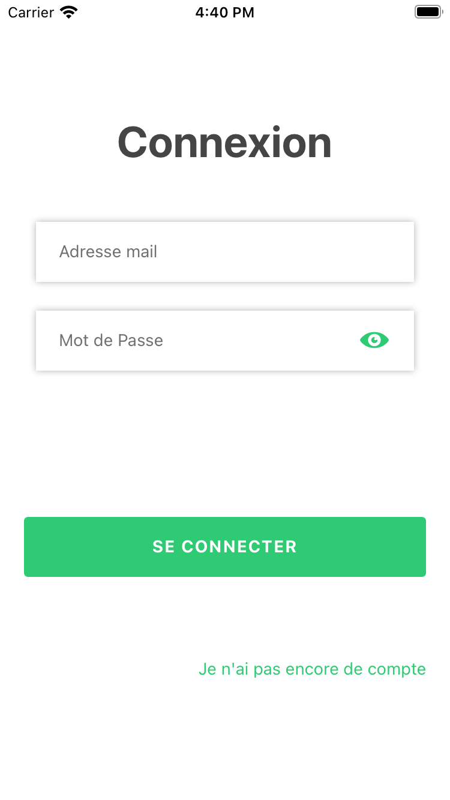
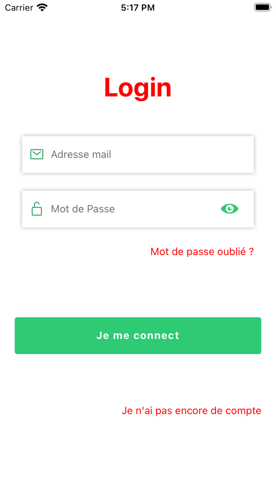

This project is a login page with built-in buttons

#### This package is currently only maintained for Expo managed React Native projects, support for bare React Native projects is coming soon

## Installation

Add the dependency:

```
npm i volkeno-react-native-login
```

or

```
yarn add volkeno-react-native-login
```

## Peer Dependencies

##### IMPORTANT! You need install them.

```json
 "react": "^16.0.0-beta.5",
 "react-native": "^0.49.1"
```

## Basic Usage

**First step:** import the component:

```javascript
import LoginVolkeno from "volkeno-react-native-login";
```

**Second step:** Use the login

```jsx
export default function App() {
  const [showPassword, setShowPassword] = React.useState(false);
  const [email, setEmail] = React.useState("");
  const [password, setPassword] = React.useState("");
  const [errors, setErrors] = React.useState({});

  const submit = async () => {
    Alert.alert("Félicitation", "Connexion réussie");
  };

  return (
    <View style={styles.container}>
      <LoginVolkeno
        showPassword={showPassword}
        setShowPassword={setShowPassword}
        email={email}
        setEmail={setEmail}
        password={password}
        setPassword={setPassword}
        errors={errors}
        setErrors={setErrors}
        title={"Login"}
        forgotPasswordText={"Mot de passe oublié ?"}
        OnSubmit={submit}
        textRedirectRegisterStyle={{ color: "red" }}
      />
    </View>
  );
}
```



Here we have a function which reacts when the connect button is clicked.
showPassword and setShowPassword allows you to activate or deactivate the visibility of the password.

email and setEmail allows you to enter and modify the email variable when typing it.

password and setPassword are used to enter and modify the password variable when typed.

the variables errors and setErrors are mandatory. They allow you to display errors when validating the email and password

## Configuration - Props

**Props require**

| Property        |   Type   | Default | Description                                                                     |
| --------------- | :------: | :-----: | ------------------------------------------------------------------------------- |
| showPassword    | boolean  |  false  | Activate to see the password                                                    |
| setShowPassword | function |  void   | Called for allows you to activate or deactivate the visibility of the password. |
| email           |  string  |    -    | Enter email address                                                             |
| setEmail        | function |  void   | Called for allows you to enter and modify the email variable when typing it.    |
| password        |  string  |    -    | Enter email address                                                             |
| setPassword     | function |  void   | Used to enter and modify the password variable when typed.                      |
| errors          |  object  |  void   | Object used to store email and password validation errors                       |
| setErrors       | function |  void   | They allow you to display errors when validating the email and password         |
| OnSubmit        | function |  void   | Fonction qui réagit lorsque le bouton de connexion est cliqué.                  |

**Other props**
| Property | Type | Default | Description |
| --------------- | :------: | :-----: | -------------------- |
| title | string | "Connexion" | change connection text |
| forgotPasswordText | string | - | Put a forgotten password text |
| pressForgotPassword | function | void | handle forgotPasswordText button is pressed |
| colorIconPassword | color | "#2FCA74" | eye color |
| textConnexion | string | "SE CONNECTER" | change text on login button |
| leftIconPassword | function | void | put a key icon 🔑 for the password |
| leftIconEmail | function | void | put a mail icon 📧 for the email address |
| textRedirectRegister | string | - | Allow to put a text which will make it possible to make a redirection towards the page of registration |
| pressRedirectRegister | function | void | handle textRedirectRegister button is pressed |

**Styles props**
| Property | Type | Default | Description |
| --------------- | :------: | :-----: | -------------------- |
| styles | style | {flex: 1, paddingHorizontal: 20} | modify or replace the default style of the entire page |
| textRedirectRegisterStyle | style | { color: "#2FCA74",textAlign: "center",fontSize: 14 } | change or override the default styling for textRedirectRegister |
| connexionButtonStyle | style | {backgroundColor: "#2FCA74",height: 50,minWidth: "100%",paddingHorizontal: 25} | modify or replace the default style of the connexion button |
| connexionTitleStyle | style | {color: "white",fontWeight: "bold",letterSpacing: 1,ontSize: 14} | change or override the default styling for login text |
| titleStyle | style | {marginVertical: 30,fontWeight: "bold",color: "#454545",fontSize: 36,textAlign: "center", | change or override the default styling for connexion text |
| forgotPasswordTextStyle | style | { color: "#454545" }| hange or override the default styling forgotPasswordText|

```jsx
export default function App() {
  const [showPassword, setShowPassword] = React.useState(false);
  const [email, setEmail] = React.useState("");
  const [password, setPassword] = React.useState("");
  const [errors, setErrors] = React.useState({});

  const submit = async () => {
    Alert.alert("Félicitation", "Connexion réussie");
  };

  return (
    <View style={styles.container}>
      <Login
        OnSubmit={submit}
        pressForgotPassword={() => {
          Alert.alert("change passWord");
        }}
        pressRedirectRegister={() => {
          Alert.alert("redirect regidter");
        }}
        showPassword={showPassword}
        setShowPassword={setShowPassword}
        email={email}
        setEmail={setEmail}
        password={password}
        setPassword={setPassword}
        errors={errors}
        setErrors={setErrors}
        title={"Login"}
        forgotPasswordText={"Mot de passe oublié ?"}
        forgotPasswordTextStyle={{
          color: "red",
          textAlign: "center",
        }}
        titleStyle={{
          color: "red",
          marginVertical: 30,
          fontWeight: "bold",
          fontSize: 36,
          textAlign: "center",
        }}
        textConnexion={"Je me connect"}
        leftIconPassword={
          <Icon name="ios-lock-open-outline" size={20} color={Colors.bgApp2} />
        }
        leftIconEmail={
          <Icon name="mail-outline" size={20} color={Colors.bgApp2} />
        }
        textRedirectRegisterStyle={{ color: "red" }}
        textRedirectRegister="Je n'ai pas encore de compte"
        styles={{}}
      />
    </View>
  );
}
```


